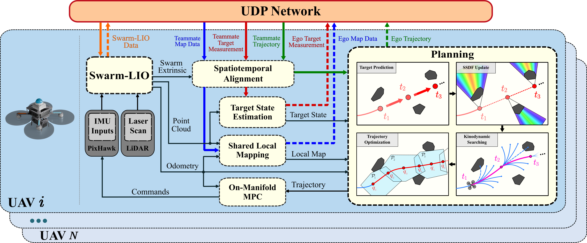

    <h1>Swarm-Tracker</h1>
    <h3>Visibility-aware Cooperative Aerial Tracking with Decentralized Swarms of LiDAR-based Robots</h3>
    <strong>IEEE Transactions on Robotics (T-RO) '26</strong>
     
        <a href="https://github.com/YLJ6038" target="_blank">Longji Yin</a>,
        <a href="https://github.com/RENyunfan" target="_blank">Yunfan Ren</a>,
        <a href="https://github.com/zfc-zfc" target="_blank">Fangcheng Zhu</a>,
        <a href="https://github.com/shiliutime" target="_blank">Liuyu Shi</a>,
        <a href="https://github.com/jackykongfz" target="_blank">Fanze Kong</a>,
        <a href="https://github.com/benxutang" target="_blank">Benxu Tang</a>,
        <a href="https://github.com/FENYUN323" target="_blank">Wenyi Liu</a>,
        <a href="https://sysu-hilab.github.io/people.html" target="_blank">Ximin Lyu</a>,  and
        <a href="https://mars.hku.hk/people.html" target="_blank">Fu Zhang</a>
    

         
        
         
    

    
    

# Updates
* The code will be released soon.
* **Jul. 21, 2026** - 🎉 Our paper has been accepted by ***IEEE T-RO***!
* **Oct. 5, 2023** - 🎉 Our [conference paper](https://ieeexplore.ieee.org/document/10341567) on swarm tracking was selected as an ***IROS 2023 Best Overall and Best Student Paper Award*** finalist.

The preprint of the T-RO paper is available at [arXiv](https://arxiv.org/abs/2512.01280).

# System Overview

  

Every UAV runs an identical, fully decentralized stack. Swarm-LIO2 provides onboard odometry and the swarm extrinsics from IMU and LiDAR inputs, while teammate maps, target measurements, and
trajectories are exchanged over a UDP network. After spatiotemporal alignment, target state estimation and shared local
mapping feed the planning module, where target prediction, SSDF update, kinodynamic searching, and spatiotemporal SE(3)
trajectory optimization produce a collision-free, visibility-optimized trajectory that is tracked by an on-manifold MPC.

# Highlights
* **Fully decentralized autonomy** - the swarm flies fully autonomously, with every module computed onboard in real time.
* **Heterogeneous LiDAR configurations** - validated on a swarm mixing a Livox Avia, an upward-facing Mid-360, and a downward-facing Mid-360.
* **Passive targets, unknown environments** - there is no communication whatsoever between the target and the swarm, and the environments are completely unknown beforehand.
* **Visibility maintenance** - the swarm tracks dynamic targets while keeping them fully visible in complex outdoor environments.

(Click any clip to view the full demo video on Bilibili)

## Tracking a Human Runner at Night

## Tracking a Flying Drone in a Dense Forest

## Reconfigurable Swarm Tracking with Dynamic Joining & Leaving
